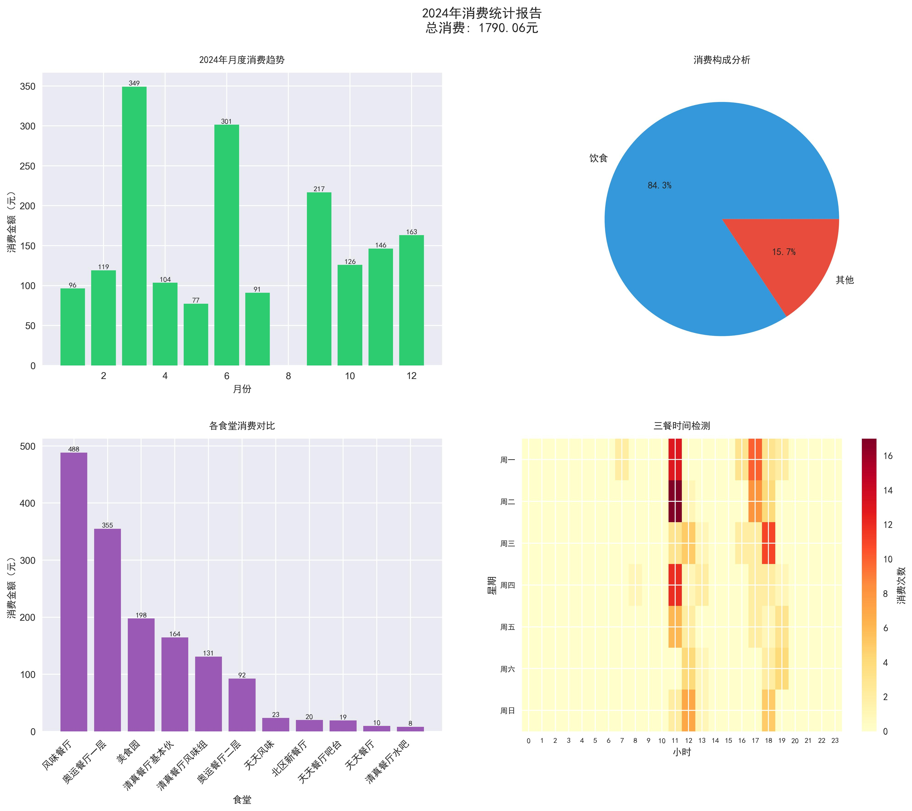
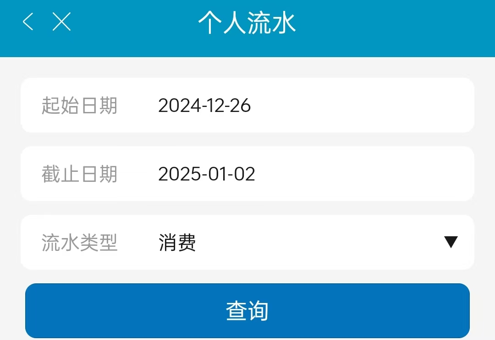

# BJUTer 2024 年度消费统计

一年过去了，你在百宫食堂里花的钱都花在哪儿了？

## 项目介绍
> 项目 idea 来源 [THU-Annual-Eat](https://github.com/leverimmy/THU-Annual-Eat) 等

本项目是一个用于统计百宫大学学生在食堂（和部分其它场所）的消费情况的脚本，并通过数据可视化的方式展示：



很可惜我不会通过模拟登录校园卡网站，所以只能用一些本办法来实现，实在抱歉相较其它学校的版本提升了使用难度。目前方法应该不会被相关部门请喝茶，如有更好、更安全的方案欢迎在 issue 或工大喵中讨论。

**请勿用于非法用途，否则后果自负。**

## 使用方法
### 1. 本地运行

1. clone 源码
```sh
git clone https://github.com/bjut-swift/BJUT-Annual-Eat.git
```

2. 用工具如 `ProxyPin` 从日新工大 APP 的下图页面中获取你的 `openid` 和 `cookie` ，参考 `src/bjut_annual_eat/config.example.yaml` 配置 `config.yaml`
   

> 注意这里要选择 “流水类型” 为 “消费” ，否则会获取不到数据

3. 下载依赖 
```sh
pip install -e .
```

4. 运行 `python -m src.bjut_annual_eat.query` 测试获取数据，如果成功，则可以运行 `python -m src.bjut_annual_eat.stat` 生成统计图表，结果会输出在本地的 `output` 目录下

### 2. Docker Compose 运行

1. 安装 Docker 和 Docker Compose
2. `git clone https://github.com/bjut-swift/BJUT-Annual-Eat.git && cd BJUT-Annual-Eat`
3. 同上述方法配置 `src/bjut_annual_eat/config.yaml.example` 中的 `openid` 和 `cookie`
4. 运行 `docker compose up --build`，结果会输出在本地的 `output` 目录下

## 其它

如果您认为项目的部分内容侵犯了您的合法权益，请联系项目维护者，我们会尽快删除相关内容。